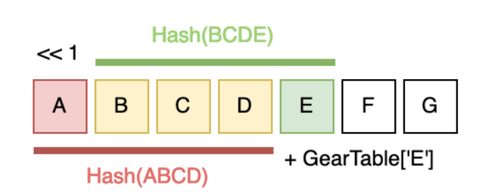

**a Fast and Efficient Content-Defined Chunking Approach for Data Deduplication**

#### Idea
gear hash 虽然比CDC快得多，但是因其断点寻找方式，重复数据删除率低，分块大小波动很大，也容易错位。滑窗大小不灵活等等。
FastCDC 的核心依然是使用 Gear 滚动哈希函数，因此被归类为基于 Gear 的 CDC 算法。做了以下三件事：增强哈希判断阶段；跳过次最小块切点；以及规范化分块。
#### The work of this method：
##### fp的计算方式：
	以8KB滑窗 13个1为例。
每个1KB的块会通过GearTable算出一个32位的哈希值。
给已有的fp（64位）左移一位（\*2），然后把新加入的块的哈希值（32位）加进来。
![[Pasted image 20240604110551.png]]
![[Pasted image 20240604111037.png]]
##### 断点的确定方式
	fp&mask == 0
	gear's mask一定要高x位设置为1，即0000...0111111
那么被滚出滑窗的A块，其哈希值所影响的fp范围为高14位到高45位，所以不会与mask产生交互，即不会影响断点的形成。能与mask交互的只有滑窗内部的13个块（字节）
#### Readme
1. 滑窗指的是在原数据上的有效滑窗，即便你可以将滑窗开到32KB，但如果mask只有在最高位的13个1，那么实际影响断电的也只有8KB。
2. 此外，这种方法在增量场景下我觉得会因为其滑窗太小导致断点的鲁棒性降低。
	8kB的断点由13B的内容决定，只改一个字节的内容也有13/8192（破坏高13位）+8179/8192*13*1/8192（任意替换其他字节时，会影响13个fp，然后每个fp有1/8096的）的概率去影响断点。约等于哪怕只替换一个块中的任意一个字节，就有13/8192的概率去破坏原断点，有13/8192的概率生成新断点。
	同时这个问题也被[[fastCDC]]提出来，说他滑窗太小容易在去重场景下分块错位。
3. [[Odess]]真有点搞吧，为了提升design量缝合上了gear hash是吧。Odess的核心工作是从普通CDC来的灵感设计了CDS采样用于提取特征时减少时间消耗，这作为design1。又用了gearhash来代替N-transform的rabinhash减少时间消耗作为design2。然后没了。

####  References
https://www.usenix.org/system/files/conference/atc16/atc16-paper-xia.pdf paper
https://joshleeb.com/posts/fastcdc.html blog